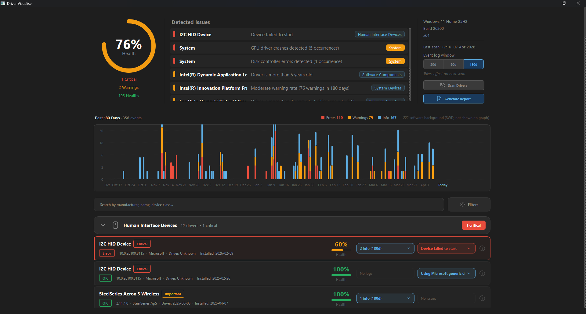
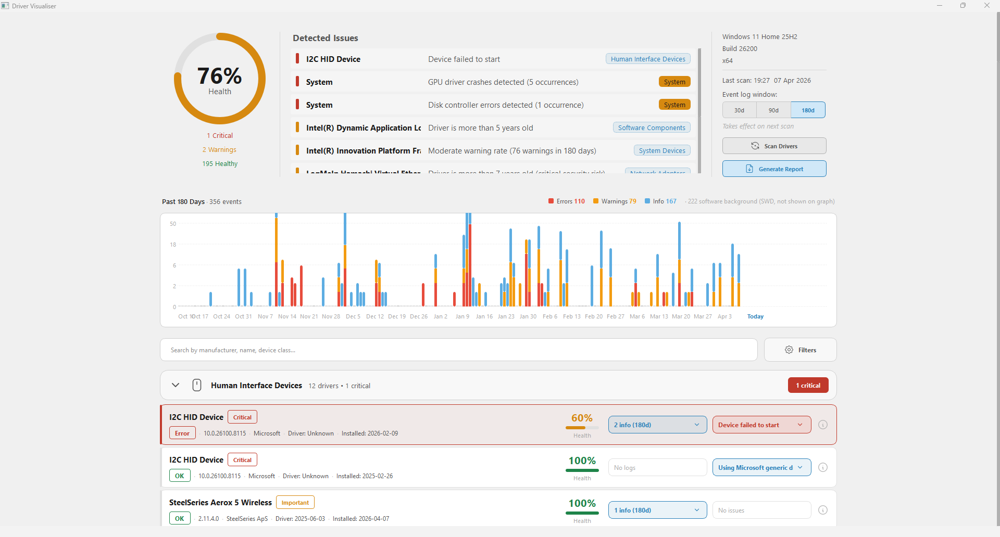
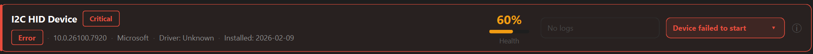
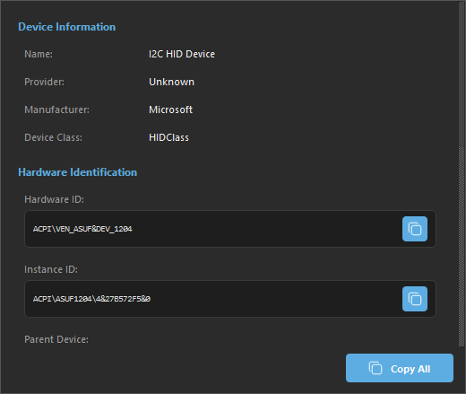
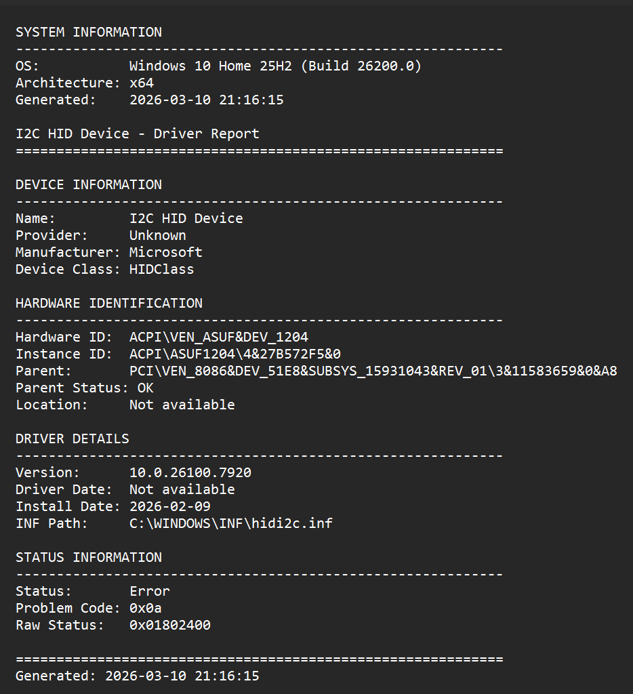

# Driver Visualiser

**A Windows diagnostic tool for instant driver health monitoring, event analysis, and system stability assessment.**

Driver Visualiser brings together what Device Manager and Event Viewer do separately - and extends both significantly. Weighted health scoring across every installed driver, a 180-day event history timeline, system-wide hardware failure detection, and exportable diagnostic reports. All in one place, with a clean interface that works in both dark and light themes.



---

## What It Does

Getting from "something is wrong" to "here is what is wrong, why, and how bad" normally means jumping between multiple tools - manually cross-referencing error codes and timestamps with no priority ordering or health context.

Driver Visualiser compresses that workflow into a single scan. Critical issues surface immediately with full context: health scores, active problem codes translated to plain English, event log frequency analysis, driver age, signature status, and a visual timeline of every hardware event over the past 30, 90, or 180 days. Generate a diagnostic report with one click and share it with a manufacturer or support team.

---

## Key Features

### Instant Issue Detection
- Scans all installed drivers on startup (typically under 10 seconds)
- **Priority-based sorting:** critical failures appear at top with red indicators
- **Importance-weighted display:** GPU and storage failures ranked above HID peripherals
- Categories with issues expand automatically - healthy drivers stay collapsed
- **Dashboard issue list:** actionable problems only, sorted critical-first with human-readable descriptions

### Intelligent Health Scoring (0-100)

Every driver receives a health score computed from five independent signal tiers:

**Tier 1 - Critical flags** (`-40` penalty each):
- `DRIVER_BLOCKED` - Windows blocked this driver from loading
- `PROBLEM_CODE_CRITICAL` - active Windows PnP problem code (translated to plain English)

**Tier 2 - Warning flags**:
- `UNSIGNED_DRIVER` - driver is not digitally signed (`-15`)
- `NEEDS_RESTART` - pending restart required for driver to function correctly (`-15`)
- `GHOST_DEVICE` - device not physically present (`-10`)
- `GHOST_DEVICE_STALE` - device absent for 6+ months, safe to remove (`-3`)
- `DEVICE_DISCONNECTED` - device is disconnected (`-10`)
- Graduated driver age penalties (uses driver date, falls back to install date):
  - 2+ years: `OUTDATED_DRIVER_AGING` (`-3`)
  - 3+ years: `OUTDATED_DRIVER` (`-10`)
  - 5+ years: `OUTDATED_DRIVER_VERY_OLD` (`-12`)
  - 7+ years: `OUTDATED_DRIVER_ANCIENT` (`-15`, flagged as security risk)

**Tier 3 - Caution flags** (missing metadata, escalated for critical devices):
- `NO_VERSION_INFO` / `NO_VERSION_INFO_CRITICAL` (`-5` / `-8`)
- `NO_DRIVER_DATE` / `NO_DRIVER_DATE_CRITICAL` (`-3` / `-5`)
- `UNKNOWN_MANUFACTURER` / `UNKNOWN_MANUFACTURER_IMPORTANT` (`-2` / `-3`)

**Tier 4 - Info flags** (no penalty, informational):
- `USER_DISABLED` - device intentionally disabled by user (shown in red but not penalised)
- `VIRTUAL_DEVICE` - software/virtual device, excluded from system scoring
- `GENERIC_DRIVER` - Microsoft inbox driver, may lack manufacturer optimisations
- `SYSTEM_CRITICAL` - cannot be disabled (non-removable system device)

**Tier 5 - Event log frequency** (evaluated before warning flags):

Critical/Error event rates per driver over the scan window:

| Rate | Flag | Penalty |
|------|------|---------|
| >= 5.0/day | `CRITICAL_ERROR_RATE_SEVERE` | `-40` |
| >= 2.0/day | `CRITICAL_ERROR_RATE_HIGH` | `-15` |
| >= 0.5/day | `CRITICAL_ERROR_RATE_MODERATE` | `-10` |
| < 0.5/day | `CRITICAL_ERROR_RATE_LOW` | `-5` |

Warning event rates follow a parallel scale (`-10` to `-2`).

```
Final Score = max(0, 100 + sum of all applicable penalties)
```

Known placeholder dates (Microsoft 2006-06-21, Intel 2009-04-21, and others) are filtered before age evaluation, with install date used as fallback.

### Importance Classification

Hardware ID prefixes determine the weight each driver carries in the system score:

| Tier | Prefixes | Weight | Examples |
|------|----------|--------|---------|
| **Critical** | `ACPI\`, `PCI\`, `PCIROOT\`, `IDE\`, `SCSI\` | 4x | GPU, chipset, storage controllers |
| **Important** | `USB\`, `HDAUDIO\`, `DISPLAY\`, `STORAGE\`, `BTH\`, `SD\`, `PCMCIA\` | 2x | Network, audio, USB, Bluetooth |
| **Optional** | `HID\`, `PRINTENUM\` | 1x | HID peripherals, printers |
| **Virtual** | `SWD\`, `SW\`, `ROOT\`, `UMB\` | 0x | Software devices, excluded entirely |

### System Health Score

The system-level score is computed in two steps:

**Step 1 - Weighted average** across all non-virtual drivers (Critical=4x, Important=2x, Optional=1x). User-disabled devices are counted as healthy since disabling is an intentional action.

**Step 2 - System-level penalty flags** applied on top:

| Flag | Condition | Penalty |
|------|-----------|---------|
| `CRITICAL_DRIVERS_PRESENT` | Any drivers with health < 70 | `-8` per driver, max `-25` |
| `MULTIPLE_WARNINGS` | 3+ drivers with health 70-89 | `-5` |
| `UNSIGNED_DRIVERS_PRESENT` | Any unsigned drivers | `-5` |
| `POOR_DRIVER_METADATA` | >50% of important/critical devices missing date | `-3` |
| `SYSTEMWIDE_ERROR_RATE_*` | SystemWide event error rate (4 tiers) | `-3` to `-12` |
| `SYSTEMWIDE_WARNING_RATE_*` | SystemWide event warning rate (3 tiers) | `-2` to `-6` |
| `GPU_CRASHES_DETECTED` | NVIDIA/AMD Event 153 in SystemWide log | `-2` |
| `UMDF_FRAMEWORK_FAILURES` | UMDF Events 10116/10120/10121 | `-3` |
| `DISK_CONTROLLER_ERRORS` | disk driver Events 11/153 | `-2` |
| `STORAGE_CONTROLLER_ERRORS` | storahci/stornvme/iaStorAC Events 129/153 | `-2` |
| `NETWORK_ADAPTER_FAILURES` | Intel/Realtek/Broadcom Events 5002-5010 | `-1` |
| `VM_NETWORK_ERRORS` | VirtualBox network Event 12 | `-1` |

### Event Log Integration

Driver Visualiser queries three separate Windows Event Log channels per scan:

**Query 1 - System log (core providers):**
- `Microsoft-Windows-Kernel-PnP` - all severity levels + whitelisted lifecycle events (400, 420, 430, 431)
- `Microsoft-Windows-DriverFrameworks-UserMode` - UMDF driver failures
- `Microsoft-Windows-UserPnP` - user-mode PnP events

**Query 2 - Configuration log:**
- `Microsoft-Windows-Kernel-PnP/Configuration` - device install, restart required, removal events

**Query 3 - Hardware provider log (batched in groups of 10 to stay within XPath query length limits):**

Static provider whitelist covering ~90% of consumer hardware:

| Category | Providers |
|----------|-----------|
| GPU | `nvlddmkm` (NVIDIA), `amdkmdag`/`atikmdag` (AMD), `igfx`/`igd10iumd64`/`igdkmd64` (Intel) |
| Storage | `disk`, `storahci`, `stornvme`, `iaStorAC` |
| Network | `Netwtw10/14/16` (Intel WiFi), `e1i65x64` (Intel Ethernet), `rt640x64`/`rtwlane`/`rtux64w10`/`RTKVHD64` (Realtek), `bcmwl63a` (Broadcom) |
| USB/System | `USBXHCI`, `MEIx64`, AMD GPIO/I2C, VirtualBox network |

**Event classification** - every event is tagged into one of three categories:
- `DeviceMapped` - contains a `DeviceInstanceId`, shown in driver card + timeline
- `SystemWide` - no device ID, shown in timeline and factored into system-level penalty scoring
- `SwdBackground` - `SWD\` software device events, low-priority collapsed section in UI

**Spam filter** - 7 confirmed-noise events are excluded regardless of provider:

| Event ID | Provider | Reason |
|----------|----------|--------|
| 6 | FilterManager | Filter driver loaded at boot - boot noise |
| 6062 | Netwtw14 | LSO (Large Send Offload) telemetry |
| 7021 | Netwtw14 | WiFi connection telemetry |
| 11, 16 | Kernel-General | Registry TxR / hive access - not driver health |
| 44 | WindowsUpdateClient | Update download started |
| 153 | Kernel-Boot | VBS status at boot |

Queries use XPath via the Windows Event Log API (`EvtQuery`). All event record parsing is done manually via `std::wstring` field extraction - no XML DOM, no third-party parsers, handles both single and double quote attribute formats across Windows versions.

### Event Timeline and Day Drill-Down

The **Event Timeline Widget** renders a stacked bar chart of all driver events across the selected scan window (30, 90, or 180 days):

- Bars are colour-coded: red (Critical/Error), orange (Warning), blue (Info/lifecycle)
- SWD background events tracked separately - counted in tooltip but excluded from bar height
- **Smart Y-axis scaling:** rounds up to clean tick values; if one day is an outlier, the scale is capped at 3x the second-highest value to keep other bars readable
- **Dynamic bar width:** adapts to window size and day count - spacing reduces from 4px to 1px across 30/90/180 day ranges so bars are always wider than gaps
- Hover shows a per-severity breakdown tooltip; clicking any bar opens the Day Events Popup

The **Day Events Popup** shows all events for a selected day in chronological order:

- Deduplicates child device events by `(timestamp, eventId, provider)` tuple
- Consecutive events from the same device within a 30-second window are visually connected with a **thread dot-line** in accent colour - makes burst failures immediately obvious
- Chain keys require a full three-part `BUS\DEVICE\INSTANCE` path; two-part IDs shared across USB composite children are excluded to prevent false grouping
- `SwdBackground` events are in a collapsible "Software background activity" section at the bottom
- Popup is screen-aware and repositions automatically if it would overflow screen bounds

### One-Click Diagnostic Reports

**Text Reports (.txt):**
- Executive summary with overall system health
- Critical and warning issues with full diagnostic detail
- Per-driver inventory grouped by device category
- Event log summary for the selected scan window
- Statistics: health distribution, driver age, importance breakdown
- Actionable recommendations

**HTML Reports (.html):**
- Same structure, formatted for sharing
- Colour-coded severity indicators
- Suitable for attaching to support tickets or manufacturer reports

A notification toast appears on completion.

### Search and Filtering
- **Text search:** filter by device name, manufacturer, or device class
- **Manufacturer filter:** multi-select checkbox popup
- **Status filter:** show only critical, warning, or healthy drivers
- **300ms debounce** - responsive typing without scan lag

### Theming
- **Dark and light themes**, auto-detected from Windows system colour scheme
- All surfaces, borders, text roles, and semantic colours defined as named tokens in `AppTheme::Colors`
- Re-reads OS scheme on `QStyleHints::colorSchemeChanged`
- Scrollbar stylesheet provided centrally via `AppTheme::scrollbarStyleSheet()`

---
## Screenshots

### Dashboard - Dark Theme

*System health score, priority-sorted issue list, and driver inventory with importance indicators*

### Dashboard - Light Theme



### Driver Card and Health Flags

*Per-driver health score, active flags with plain-English descriptions, and event log indicator*

### Driver Info Popup

*Full technical metadata - Hardware ID, INF path, version, install date, parent device*

### Per Driver Report

*One-click copy as txt, formatted for sharing with ai or manufacturer support*
## Technical Architecture

The application is split into three layers with strict separation - the UI never calls Windows APIs directly, and the data layer has no Qt dependency.

```
  ╔══════════════════════════════════════════════════════════════════╗
  ║                      UI  LAYER  (Qt6 Widgets)                    ║
  ║                                                                  ║
  ║  ┌─────────────────┐  ┌──────────────────┐  ┌────────────────┐   ║
  ║  │   MainWindow    │  │ DashboardWidget  │  │ ScoreRingWidget│   ║
  ║  │  orchestration  │  │ score·issues·    │  │  0-100 ring    │   ║
  ║  │  + scan trigger │  │ controls·theme   │  │  visualisation │   ║
  ║  └────────┬────────┘  └───────┬──────────┘  └───────┬────────┘   ║
  ║           │                   │                     │            ║
  ║  ┌────────▼───────────────────▼─────────────────────▼────────┐   ║
  ║  │                     Driver List                           │   ║
  ║  │  CategorySectionWidget  ──>  DriverCardWidget             |   ║
  ║  │  (collapsible groups)        (health bar · flags · log)   │   ║
  ║  └───────────────────────────────────────────────────────────┘   ║
  ║                                                                  ║
  ║  ┌──────────────────────────────────────────────────────────┐    ║
  ║  │                  Event Timeline                          │    ║
  ║  │  EventTimelineWidget  ──>  DayEventsPopup                │    ║
  ║  │  (stacked bar chart)        (threaded event cards)       │    ║
  ║  └──────────────────────────────────────────────────────────┘    ║
  ║                                                                  ║
  ║  Popups: DriverInfoPopup · ErrorLogPopupWidget · FlagPopupWidget ║
  ║  Utils:  SearchFilterBar · IssueListWidget · ReportNotification  ║
  ╚══════════════════════════╦═══════════════════════════════════════╝
                             ║
  ╔══════════════════════════╩═══════════════════════════════════════╗
  ║                  BUSINESS LOGIC  LAYER                           ║
  ║                                                                  ║
  ║  Scoring                     Grouping & Display                  ║
  ║  ├─ HealthScoreEvaluator     ├─ CategoryGrouper                  ║
  ║  │  (5-tier, per driver)     ├─ CategoryProcessor                ║
  ║  ├─ DriverImportanceEval.    └─ ClassNameMapper                  ║
  ║  │  (HW ID → 4 tiers)                                            ║
  ║  └─ SystemHealthSummary      Presentation                        ║
  ║     (weighted avg + flags)   ├─ AppTheme  (dark/light tokens)    ║
  ║                              ├─ IconProvider  (SVG cache)        ║
  ║                              └─ CategoryIconMapper               ║
  ╚══════════════════════════╦═══════════════════════════════════════╝
                             ║
  ╔══════════════════════════╩═══════════════════════════════════════╗
  ║                    CORE / DATA  LAYER                            ║
  ║                                                                  ║
  ║  DriverScanner          SetupAPI enumeration of all devices      ║
  ║  ErrorLogReader         3-channel Event Log pipeline             ║
  ║  SystemInfoCollector    OS version from registry                 ║
  ║  TextReportFormatter    Structured .txt report generation        ║
  ║  HtmlReportFormatter    Interactive .html report generation      ║
  ║  ReportGenerator        Orchestrates formatters + file output    ║
  ╚══════════════════════════════════════════════════════════════════╝
```

### Technology Stack

- **Language:** C++20 - `std::optional`, `std::chrono::sys_days`, `std::chrono::system_clock`, RAII throughout
- **GUI:** Qt6 Widgets - custom-painted widgets, SVG icon rendering, DPI-aware pixmaps at 1x/1.5x/2x
- **Windows APIs:**
  - `SetupAPI` - device and driver enumeration (`SetupDiGetClassDevsW`, `SetupDiEnumDeviceInfo`, `SetupDiGetDevicePropertyW`)
  - `Configuration Manager API` - device status and tree traversal (`CM_Get_DevNode_Status`, `CM_Get_Parent`, `DN_*` flag decoding)
  - `Windows Event Log API` - XPath queries + manual XML parsing (`EvtQuery`, `EvtNext`, `EvtRender`, `EvtFormatMessage`)
  - `Registry API` - OS version detection
- **No external dependencies** beyond Qt6 - all parsing, formatting, and data structures in standard C++20

### Code Structure

```
src/
├── core/
│   └── models/
│   |   ├── DeviceCategory.h
│   |   ├── DriverInfo.h
│   |   ├── ErrorLogEntry.h
│   |   ├── HealthFlag.h
│   |   └── SystemInfo.h
|   ├──reporting/
│   |   ├── formatters/
│   |   │   ├── HtmlReportFormatter.cpp/h
│   |   │   ├── IReportFormatter.h
│   |   │   └── TextReportFormatter.cpp/h
│   |   └── ReportGenerator.cpp/h
|   ├──scanner/
│   |   ├── DriverScanner.cpp/h
│   |   ├── ErrorLogReader.cpp/h
│   |   └── SystemInfoCollector.cpp/h
|   └── scoring/
│       ├── DriverImportanceEvaluator.cpp/h
│       ├── HealthScoreEvaluator.cpp/h
│       └── SystemHealthSummary.cpp/h
├── ui/
│   ├── dashboard/
│   │   └── DashboardWidget.cpp/h
│   ├── popups/
│   │   ├── DayEventsPopup.cpp/h
│   │   ├── DriverInfoPopup.cpp/h
│   │   ├── ErrorLogPopupWidget.cpp/h
│   │   ├── FilterPopupWidget.cpp/h
│   │   └── FlagPopupWidget.cpp/h
│   ├── widgets/
│   │   ├── CategorySectionWidget.cpp/h
│   │   ├── DriverCardWidget.cpp/h
│   │   ├── ErrorLogIndicatorWidget.cpp/h
│   │   ├── EventTimelineWidget.cpp/h
│   │   ├── FlagIndicatorWidget.cpp/h
│   │   ├── IssueListWidget.cpp/h
│   │   ├── ReportNotification.cpp/h
│   │   ├── ScoreRingWidget.cpp/h
│   │   └── SearchFilterBar.cpp/h
│   └── mainwindow.cpp/h
└── utils/
    ├── formatters/
    │   ├── DriverDateFormatter.cpp/h
    │   ├── DriverImportanceFormatter.cpp/h
    │   ├── DriverStatusFormatter.cpp/h
    │   └── DriverVersionFormatter.cpp/h
    ├── grouper/
    │   ├── CategoryGrouper.cpp/h
    │   └── CategoryProcessor.cpp/h
    ├── mappers/
    |   └── ClassNameMapper.cpp/h
    ├── CategoryIconMapper.cpp/h
    ├── IconProvider.cpp/h
    ├── AppTheme.cpp/h
```

---

## How It Works

### 1. Driver Enumeration (SetupAPI)

```cpp
HDEVINFO hDevInfo = SetupDiGetClassDevsW(
    nullptr, nullptr, nullptr,
    DIGCF_PRESENT | DIGCF_ALLCLASSES  // All present devices
);

SP_DEVINFO_DATA devInfoData;
for (DWORD i = 0; SetupDiEnumDeviceInfo(hDevInfo, i, &devInfoData); i++) {
    // Per driver: name, manufacturer, provider, Hardware ID,
    // class GUID, version, driver date, install date,
    // status/problem codes, parent device, INF path, driver files
}
```

Collects per driver: name, manufacturer, provider, Hardware ID, device class GUID, version, driver date, install date, `CM_PROB_*` problem code, raw `DN_*` status flags, parent instance ID and status, INF path, driver file list, digital signature status.

### 2. Event Log Pipeline

```cpp
// Three separate XPath queries per scan:
// Query 1: System log - core providers + whitelisted lifecycle events
// Query 2: Kernel-PnP/Configuration - lifecycle events only
// Query 3: Hardware providers - batched in groups of 10

std::wstring coreQuery =
    L"*[System["
    L"  (Provider[@Name='Microsoft-Windows-Kernel-PnP'] or ...)"
    L"  and ((Level=1 or Level=2 or Level=3)"
    L"    or (Level=4 and (EventID=400 or EventID=420"
    L"      or EventID=430 or EventID=431)))]]";

auto events = querySingleLog(L"System", coreQuery, uliCutoff, days);
```

Each event is parsed from raw XML (manual field extraction - no DOM), classified into `DeviceMapped` / `SystemWide` / `SwdBackground`, filtered through the spam blacklist, and matched to drivers by `DeviceInstanceId` with parent-child fallback.

### 3. Health Scoring

```
Per-Driver Score:
  Base = 100
  +-- Tier 1 (Critical):    DRIVER_BLOCKED, PROBLEM_CODE_CRITICAL        -40 each
  +-- Tier 5 (Event rate):  evaluated first, before warning flags
  |     CRITICAL_ERROR_RATE_SEVERE / HIGH / MODERATE / LOW               -40/-15/-10/-5
  +-- Tier 2 (Warning):     UNSIGNED, NEEDS_RESTART, GHOST, AGE          -3 to -15
  +-- Tier 3 (Caution):     missing metadata, escalated for Critical      -2 to -8
  +-- Tier 4 (Info):        USER_DISABLED, VIRTUAL_DEVICE, etc.          0
  Final = max(0, Base + penalties)

System Score:
  Base = weighted_avg(driver scores, Critical=4x, Important=2x, Optional=1x)
  +-- CRITICAL_DRIVERS_PRESENT:  -8 per critical driver, max -25
  +-- MULTIPLE_WARNINGS:         -5 if 3+ warning-tier drivers
  +-- UNSIGNED_DRIVERS_PRESENT:  -5 if any unsigned
  +-- POOR_DRIVER_METADATA:      -3 if >50% of important/critical lack date
  +-- SystemWide event analysis: GPU, disk, storage, network, UMDF flags
  Final = clamp(Base + penalties, 0, 100)
```

### 4. Event Timeline Rendering

```cpp
// Smart scale prevents single-spike distortion
int calculateSmartMaxScale() const {
    // Rounds to clean values: 5, 10, 20, 30, 50, 100...
    // For outlier days: cap at 3x the second-highest count
    int cappedMax = std::min(actualMax, secondMax * 3);
}

// Dynamic bar width - bars always wider than gaps
int spacing = std::max(1, BAR_SPACING - (totalBars > 90 ? 3 : totalBars > 45 ? 2 : 0));
int barWidth = (chartWidth - (totalBars - 1) * spacing) / totalBars;
```

### 5. Device Chain Detection

```cpp
// Events from the same device within 30 seconds form a visual thread
static constexpr int GAP_SECONDS = 30;

// Valid chain key requires full BUS\DEVICE\INSTANCE path (2+ backslashes)
// Two-part IDs shared across USB composite children are excluded
auto isValidChainKey = [](const std::wstring& id) -> bool {
    size_t first = lower.find(L'\\');
    return lower.find(L'\\', first + 1) != std::wstring::npos;
};
```

---

## Comparison

Driver Visualiser is a diagnostic tool, not a driver updater. It does not download, install, or modify any drivers or system files.

| Feature | Driver Visualiser | Device Manager | Event Viewer | Driver Updaters |
|---------|:-----------------:|:--------------:|:------------:|:---------------:|
| All drivers scanned and ranked instantly | ✅ | ❌ Manual navigation | ❌ | ⚠️ Update focus only |
| Health score per driver (0-100) | ✅ 5-tier scoring | ❌ Binary OK/Error | ❌ | ❌ |
| Importance-weighted system score | ✅ 4 tiers + penalties | ❌ | ❌ | ❌ |
| Event log integration | ✅ 3 channels, 30-180 days | ❌ | ✅ Manual filtering | ❌ |
| System-wide hardware event analysis | ✅ GPU/disk/network/UMDF | ❌ | ✅ Manual | ❌ |
| Visual event timeline | ✅ Stacked bar, 180 days | ❌ | ❌ | ❌ |
| Per-day event drill-down with device chains | ✅ | ❌ | ❌ | ❌ |
| Human-readable error translation | ✅ | ❌ Raw codes | ⚠️ Raw log text | ❌ |
| Driver age analysis (graduated 2-7 years) | ✅ | ❌ | ❌ | ⚠️ Basic |
| Export diagnostic reports (.txt / .html) | ✅ | ❌ | ❌ | ⚠️ Limited |
| Read-only, no system modifications | ✅ | ✅ | ✅ | ❌ |
| Dark and light theme | ✅ Auto-detected | ❌ | ❌ | ⚠️ Varies |

---

## FAQ

**Q: Is this safe to run?**
Driver Visualiser is entirely read-only. It never modifies drivers, registry keys, or system files.

**Q: Why does it need Administrator privileges?**
Windows requires elevation for Event Log queries on the System channel, full device status codes via `CM_Get_DevNode_Status`, and certain `SetupDiGetDevicePropertyW` properties. Basic driver listing works without admin but full diagnostics require elevation.

**Q: Will this work on Windows 7/8?**
No. Driver Visualiser targets Windows 10 (build 19041+) due to Qt6 requirements and modern Event Log APIs.

**Q: How accurate is the health scoring?**
The scoring combines Windows PnP status codes, digital signature verification, driver age, and event log frequency analysis. Scores are diagnostic indicators - always verify critical findings.

**Q: What is a "SystemWide" event?**
Some hardware events (GPU crashes, disk controller errors) are logged without a `DeviceInstanceId` and cannot be automatically matched to a specific driver card. Driver Visualiser captures these as `SystemWide` events, displays them in the timeline, and factors them into the system-level score separately.

**Q: Why does the scan window max out at 180 days?**
180 days covers the vast majority of meaningful driver failure history and is the current upper limit based on Event Log API performance characteristics.

---

## Requirements

- **OS:** Windows 10 (build 19041+) or Windows 11
- **Privileges:** Administrator (required for full diagnostics)
- **Runtime:** Visual C++ Redistributable 2022 (included in installer)

---

## Why I Built This

Windows has all the information you need to diagnose driver issues - it's just
scattered across tools that were never designed to work together. Getting a
concrete answer with evidence normally means 10-15 minutes of jumping between
Device Manager, Event Viewer, and Google.

A few scenarios where Driver Visualiser cuts that down to seconds:

- **Intermittent failures** - the timeline shows whether a GPU or storage
  controller started crashing before or after a recent driver update
- **Unstable system** - SystemWide event analysis surfaces UMDF and disk
  controller failures that don't map to a single device in Device Manager
- **Handing off a diagnosis** - the exported report gives a support team
  everything they need without them reproducing the environment
- **Second-hand machine** - 180-day event history and driver age analysis
  tells you a lot about how a system has been treated

The I2C touchpad on my own laptop is what started it. Fifteen minutes to
manually track down error code 0x0a across two tools. Driver Visualiser
finds it in one scan.

---
## Beta Status

Driver Visualiser is functional and has been tested across a small number of
real systems. The core pipeline - driver enumeration, event log parsing,
health scoring, and report generation - works reliably. A few things worth
knowing before you run it:

**Penalty calibration** - the scoring thresholds are based on intuition and
a small test dataset. Most values should be in the right ballpark, but some
penalties may feel too harsh or too lenient on hardware configurations that
weren't part of early testing. If something looks off, it probably is - feedback
on specific flag values is genuinely useful at this stage.

**Detection coverage** - the event log provider list covers the most common
consumer hardware, but there are gaps. Exotic chipsets, enterprise storage
controllers, and less common WiFi adapters may not be picked up by the hardware
provider queries. This is on the improvement list.

**UI polish** - a few rough edges remain in layout and interaction, particularly
at non-standard DPI settings and on smaller displays.

If you run into anything unexpected, open an issue with the scan window used,
the flag that triggered, and the driver in question. Real-world data is the
fastest way to improve the scoring model.

---
## Contact

**Author:** Artemijs Kaufmans
**Email:** artemonkaufmann@icloud.com
**LinkedIn:** [linkedin.com/in/artemijs-kaufmans](https://linkedin.com/in/artemijs-kaufmans)

---

## License

Source available for portfolio and code review purposes only.
See [LICENSE](LICENSE) for full terms.

---

## Acknowledgements

- [Qt Framework](https://www.qt.io/) - C++ GUI framework (LGPL v3)
- [Tabler Icons](https://tabler.io/icons) - Open source SVG icon set (MIT)
- [Microsoft Windows API Documentation](https://docs.microsoft.com/en-us/windows/) - SetupAPI, Configuration Manager, and Event Log references

---

**Driver Visualiser** - Because driver diagnostics should take seconds, not a CS degree.