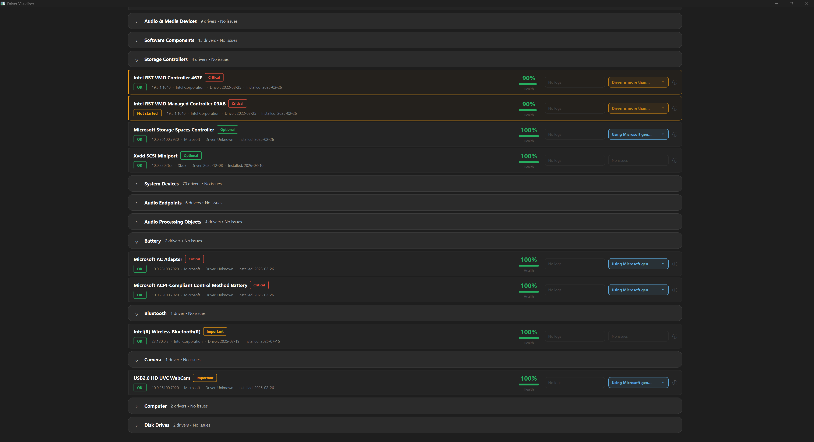

# Driver Visualiser

**A Windows diagnostic tool for instant driver health monitoring and troubleshooting.**

Driver Visualiser consolidates Windows Device Manager and Event Viewer into a unified interface with real-time health scoring, priority-based issue detection, and one-click troubleshooting reports.


---

## The Problem

When Windows hardware fails, troubleshooting requires:
- Opening Device Manager and expanding categories to hunt for yellow warning icons
- Separately launching Event Viewer and filtering thousands of system logs
- Manually cross-referencing cryptic error codes (e.g., `0x0a`) between tools
- 10-15 minutes of detective work for what should be instant

**Example:** A failing I2C touchpad driver appears as a small warning icon buried under "Human Interface Devices" with only an error code. Finding it requires scrolling through dozens of healthy drivers and manually checking Event Viewer for context.

**Driver Visualiser does this in 3 seconds** — critical issues surface immediately with full diagnostic context.

---

## Key Features

### Instant Issue Detection
- Scans 200+ system drivers on startup (5-10 seconds)
- **Priority-based sorting:** Critical failures appear at top with red indicators
- **Actionable filtering:** Only shows real problems (blocked drivers, failed devices, restart-required warnings)
- Categories with issues expand automatically — healthy drivers stay collapsed

### Intelligent Health Scoring (0-100%)
Every driver receives a health score based on:
- **Current status:** OK / Warning / Error / Disabled
- **Problem codes:** Windows CM_PROB_* error codes (e.g., `0x0a` = device failed to start)
- **Event log patterns:** Error frequency analysis over 7/30/90-day windows
- **Metadata quality:** Missing version info, outdated drivers (3+ years old), unsigned drivers

**Penalty tiers:**
- Critical (-40): Driver blocked, device failed to start
- Warning (-10 to -15): Unsigned, needs restart, 3+ years old
- Caution (-2 to -5): Missing version/date information
- Event log penalty: Based on error-per-day rate over scan window *(implementation in progress)*
- Info (0): User-disabled, virtual devices, generic Microsoft drivers

### Importance Classification
Drivers are weighted by system role (via Hardware ID prefixes):
- **Critical (4× weight):** GPU, storage controllers, chipset (ACPI, PCI, SCSI)
- **Important (2× weight):** Network, audio, USB, Bluetooth
- **Optional (1× weight):** HID peripherals, printers
- **Virtual (0× weight):** Software devices, excluded from scoring

### System Health Score
- **Weighted average** across all non-virtual drivers
- **System-level penalties** for multiple critical failures, unsigned drivers, poor metadata
- **User-disabled drivers excluded** from problem counts (intentional action, not a fault)

### One-Click Troubleshooting Reports

**Text Reports (.txt):**
- Executive summary with overall status
- Critical issues with full diagnostic details
- Driver inventory grouped by category
- Event log summary (past 7/30/90 days)
- Statistics: health distribution, installation age, importance breakdown
- Actionable recommendations

**Per-Driver Reports:**
- Complete technical metadata (Hardware ID, Instance ID, parent device)
- Status information (problem code, raw status flags)
- Driver details (version, date, INF path, manufacturer)

**HTML Reports (.html):**
- Interactive dashboard with the same structure
- Color-coded severity indicators
- Formatted for sharing via email or support tickets

### Event Log Integration
- Queries Windows System log for driver-related events
- Providers: `Microsoft-Windows-Kernel-PnP`, `Microsoft-Windows-DriverFrameworks-UserMode`
- Configurable lookback window: 7, 30, or 90 days
- **Manual XML parsing** (no XPath) — more reliable across Windows versions
- **Time filtering in C++** (not SQL/query syntax) — avoids API inconsistencies

### Search & Filtering
- **Search:** Filter by manufacturer, device name, or class
- **Manufacturer filter:** Multi-select checkbox popup
- **Status filter:** Show only critical, warnings, or healthy drivers
- **300ms debounce** — smooth typing without lag

---

## Technical Architecture

```
┌─────────────────────────────────────────────────────────┐
│                   UI Layer (Qt6 Widgets)                │
│  • MainWindow - Application orchestration               │
│  • DashboardWidget - Health visualization & controls    │
│  • SearchFilterBar - Search + manufacturer filtering    │
│  • CategorySectionWidget - Collapsible device groups    │
│  • DriverCardWidget - Individual driver display         │
│  • DriverInfoPopup - Technical details popup            │
│  • ErrorLogPopupWidget - Event log timeline             │
└──────────────────────┬──────────────────────────────────┘
                       │
┌──────────────────────▼──────────────────────────────────┐
│              Business Logic Layer                       │
│  • CategoryGrouper - Group drivers by device class      │
│  • CategoryProcessor - Sort by health + category stats  │
│  • SystemHealthSummary - Weighted scoring + issue list  │
│  • HealthScoreEvaluator - 0-100 scoring with penalties  │
│  • DriverImportanceEvaluator - Hardware ID classification│
│  • ClassNameMapper - Raw class → friendly display names │
└──────────────────────┬──────────────────────────────────┘
                       │
┌──────────────────────▼──────────────────────────────────┐
│                  Core / Data Layer                      │
│  • DriverScanner - SetupAPI device enumeration          │
│  • ErrorLogReader - Event Log XML parsing               │
│  • SystemInfoCollector - OS version from registry       │
│  • TextReportFormatter - Structured .txt generation     │
│  • HtmlReportFormatter - Interactive .html generation   │
└─────────────────────────────────────────────────────────┘
```

### Technology Stack
- **Language:** C++20 (modern STL, `std::optional`, `std::chrono::sys_days`, RAII patterns)
- **GUI:** Qt6 Widgets (dark theme, custom styling)
- **Windows APIs:**
  - `SetupAPI` - Device and driver enumeration (`SetupDiGetClassDevsW`, `SetupDiEnumDeviceInfo`, `SetupDiGetDevicePropertyW`)
  - `Configuration Manager API` - Device status and tree traversal (`CM_Get_DevNode_Status`, `CM_Get_Parent`)
  - `Event Log API` - System event correlation (`EvtQuery`, manual XML parsing)
  - `Registry API` - OS version detection (`RegOpenKeyExW`, `RegQueryValueExW`)
- **Architecture:** 90+ modules with clear layer separation (UI → Business Logic → Core)
- **No external dependencies:** Manual JSON parsing, no 3rd-party libraries beyond Qt6

---

## How It Works

### 1. Driver Enumeration (SetupAPI)
```cpp
HDEVINFO hDevInfo = SetupDiGetClassDevsW(
    nullptr, nullptr, nullptr,
    DIGCF_PRESENT | DIGCF_ALLCLASSES  // All present devices
);

SP_DEVINFO_DATA devInfoData;
for (DWORD i = 0; SetupDiEnumDeviceInfo(hDevInfo, i, &devInfoData); i++) {
    // Query device properties, status, version, dates, etc.
}
```

Collects per-driver:
- Name, manufacturer, provider (friendly name)
- Device class GUID and name
- Hardware ID (for importance classification)
- Version, driver date, install date
- Status code, problem code (`CM_PROB_*`)
- Parent device instance ID and status
- INF path, driver file list

### 2. Health Scoring Algorithm
```
Base Score = 100

For each health flag detected:
  - DRIVER_BLOCKED (-40)
  - PROBLEM_CODE_CRITICAL (-40) — excludes user-disabled (0x16)
  - UNSIGNED_DRIVER (-15)
  - NEEDS_RESTART (-15)
  - OUTDATED_DRIVER (-10) — 3+ years since driver date
  - GHOST_DEVICE (-10)
  - NO_VERSION_INFO (-5)
  - NO_DRIVER_DATE (-3)
  - UNKNOWN_MANUFACTURER (-2)

Event log penalty (in progress):
  - Based on error-per-day rate over scan window
  - High error frequency triggers additional penalties

Info flags (0 penalty):
  - USER_DISABLED, VIRTUAL_DEVICE, GENERIC_DRIVER, SYSTEM_CRITICAL

Final Score = max(0, Base Score + penalties)
```

**Driver date validation:** Filters out known placeholder dates:
- Microsoft: 2006-06-21, 2006-06-01
- Intel: 2009-04-21
- Dates before 2001 or after 2100

### 3. Importance Classification
```cpp
if (hardwareId.starts_with(L"ACPI\\") ||
    hardwareId.starts_with(L"PCI\\") ||
    hardwareId.starts_with(L"SCSI\\"))
    return DriverImportance::Critical;

if (hardwareId.starts_with(L"USB\\") ||
    hardwareId.starts_with(L"HDAUDIO\\") ||
    hardwareId.starts_with(L"DISPLAY\\"))
    return DriverImportance::Important;

if (hardwareId.starts_with(L"SWD\\") ||
    hardwareId.starts_with(L"ROOT\\"))
    return DriverImportance::Virtual;

return DriverImportance::Optional;
```

### 4. System Health Score
```
Weighted Average = (Σ driver_score × importance_weight) / Σ importance_weight

Weights:
  Critical  = 4×
  Important = 2×
  Optional  = 1×
  Virtual   = 0× (excluded)

System Penalties:
  - 1+ critical drivers: -8 per driver (max -25)
  - 3+ warnings: -5
  - Any unsigned drivers: -5
  - Poor metadata (>50% missing dates): -3

Final Score = max(0, Weighted Average + penalties)
```

### 5. Event Log Correlation
```cpp
// Query System log with provider filter
EvtQuery(nullptr, L"System",
    L"*[System["
    L"(Provider[@Name='Microsoft-Windows-Kernel-PnP']"
    L" or Provider[@Name='Microsoft-Windows-DriverFrameworks-UserMode'])"
    L" and (Level=1 or Level=2 or Level=3)"  // Critical, Error, Warning
    L"]]",
    EvtQueryForwardDirection
);

// Manual XML parsing to extract:
// - Event ID, timestamp, level
// - Device Instance ID (for matching to drivers)
// - Status codes, failure reasons

// Time filtering in C++ (XPath unreliable):
FILETIME ftCutoff = now - (days * 86400 * 10000000ULL);
if (event.timestamp >= ftCutoff) {
    matchedEvents.push_back(event);
}
```

### 6. Category Grouping & Sorting
```cpp
// Group by device class (like Device Manager)
map<wstring, DeviceCategory> categories = groupByDeviceClass(drivers);

// Apply friendly names from JSON mapping
category.displayName = ClassNameMapper::getDisplayName(category.className);

// Sort drivers within each category:
// 1. Health score (worst first)
// 2. Importance (Critical → Important → Optional)
// 3. Name (alphabetical)

// Sort categories by worst health:
// 1. Lowest health score in category (ascending)
// 2. Category name (alphabetical)
```

---

## Screenshots

### Main Dashboard

*90% system health, 1 critical issue instantly visible*

### Driver List with Categories

*Priority sorting - critical failures surface first, healthy drivers collapse*

### Individual Driver Card

*Full metadata: status, version, manufacturer, dates, health score, flags*

### Text Report

*Professional troubleshooting report ready for IT support*

---

## Installation & Usage

### Requirements
- Windows 10 (Build 19041+) or Windows 11
- Administrator privileges (see FAQ for details)

### Download
*(Pre-built releases coming with alpha launch - March 2026)*

### Usage
1. Run `DriverVisualiser.exe` as Administrator
2. Wait 5-10 seconds for initial scan (200+ drivers)
3. Critical issues appear at top automatically
4. Click **"Generate Report"** → Select format (Text / HTML)
5. Adjust event log window (7 / 30 / 90 days) → **"Scan Drivers"** to rescan

### Search & Filtering
- **Search bar:** Type manufacturer, device name, or class
- **Filters:** Click ⚙ Filters → Select manufacturers, status, or importance
- **Category collapse:** Click category header to expand/collapse

---

## Project Status

**Current Version:** Pre-Alpha (90% feature-complete)

### ✅ Completed (Core Features)
- [x] Driver enumeration via SetupAPI
- [x] Event log parsing and correlation (7/30/90 day windows)
- [x] Health scoring algorithm with 4-tier penalties
- [x] Importance classification (Hardware ID-based)
- [x] Weighted system health score
- [x] Priority-based UI sorting
- [x] Text report generation with detailed sections
- [x] HTML report generation (interactive)
- [x] Qt6 dark-theme UI with modern styling
- [x] Search and manufacturer filtering
- [x] Category grouping with friendly name mapping
- [x] Error log popup with event timeline
- [x] Driver info popup with technical details
- [x] Background threading for manual scans

### 🚧 In Progress (Pre-Alpha → Alpha)
- [ ] Setup/update log integration
- [ ] Graph plotting on dashboard (update history + error log correlation with dates)
- [ ] Event log penalty integration (error-per-day rate)
- [ ] Basic driver update suggestions
- [ ] Bug fixes and stability improvements
- [ ] UI theme refinements + white theme option

### 🔮 Planned (Post-Alpha)
- [ ] Expanded diagnostic capabilities
- [ ] Additional features (to be determined based on user feedback)

**Target Alpha Release:** March 2026

---

## Design Principles

- **Correctness over speed:** Accurate Windows PnP modeling, no heuristic guessing
- **User experience matters:** Diagnostic tools can be powerful and beautiful
- **Clean architecture:** Business logic isolated from UI and API layers
- **Modern C++:** RAII everywhere, no raw pointers, STL containers
- **No bloat:** Single-purpose tool, not an OS monitoring suite
- **Graceful degradation:** App works even if Event Log API fails (just no event correlation)

---

## Why I Built This

As a systems programmer working on a gaming laptop, I frequently troubleshoot driver issues. Windows' built-in tools are powerful but fragmented — you need to be a power user to diagnose problems efficiently.

**Example: My failing I2C touchpad driver**

**Device Manager:**
1. Open Device Manager
2. Expand "Human Interface Devices" (36 drivers on my system)
3. Scroll to find "I2C HID Device" (two exist, one OK, one failing)
4. Right-click → Properties → See error code `0x0a`
5. Google error code → "Device failed to start"
6. Open Event Viewer separately
7. Filter System log → Search for touchpad-related events
8. Cross-reference timestamps with recent system changes

**Time:** ~10-15 minutes

**Driver Visualiser:**
1. Open app
2. See red "I2C HID Device - Device failed to start" at top of dashboard
3. Click card → View health flags: `PROBLEM_CODE_CRITICAL`, `GENERIC_DRIVER`
4. Click error log indicator → See 12 recent failures with timestamps
5. Click "Generate Report" → Share with IT support or manufacturer

**Time:** ~30 seconds

---

## FAQ

**Q: Is this safe to run?**  
A: Driver Visualiser is **read-only** — it never modifies drivers, system files, or registry keys. It only queries Windows APIs that Device Manager uses internally.

**Q: Why does it need Administrator privileges?**  
A: Windows requires admin access for:
- Event Log queries on the System channel (security-related events)
- Detailed device status codes (`CM_Get_DevNode_Status`)
- Complete driver metadata (some SetupAPI properties)

Basic driver listing works without admin, but full diagnostics require elevation.

**Q: Will this work on Windows 7/8?**  
A: Not currently. Driver Visualiser targets Windows 10 (19041+) due to Qt6 requirements and modern Event Log APIs.

**Q: Can I uninstall or update drivers with this?**  
A: Not currently, and not planned for v2.0. Driver Visualiser focuses on diagnostics and health monitoring. For driver management, use Windows Update or manufacturer tools.

**Q: Why does scanning take 5-10 seconds?**  
A: Enumerating 200+ drivers with full metadata (status, version, dates, event logs) is I/O-intensive. Background threading is implemented for manual scans to keep the UI responsive.

**Q: Why 90 days maximum for event logs?**  
A: Currently an API performance consideration. Longer windows (180+ days) may be added based on testing and user feedback.

**Q: How accurate is the driver health scoring?**  
A: The health scoring combines multiple signals (Windows status codes, event logs, metadata quality) and has been validated against real-world driver failures. The 60% score for a failing I2C touchpad driver (problem code `0x0a`) correctly identified it as critical. However, scores are diagnostic indicators, not guarantees - always verify critical issues in Device Manager or with manufacturer support.

---

## Comparison: Driver Visualiser vs. Built-in Tools

| Feature | Driver Visualiser | Device Manager | Event Viewer |
|---------|-------------------|----------------|--------------|
| **Scan all drivers instantly** | ✅ 200+ in 5-10s | ❌ Manual navigation | ❌ N/A |
| **Show failure root cause** | ✅ Event correlation | ❌ Only error codes | ✅ Raw logs only |
| **Priority-based sorting** | ✅ Critical first | ❌ Alphabetical | ❌ Chronological |
| **Health scoring (0-100%)** | ✅ Per-driver + system | ❌ Binary OK/Error | ❌ N/A |
| **Importance classification** | ✅ 4 tiers | ❌ | ❌ |
| **Event log integration** | ✅ 7/30/90 days | ❌ | ✅ Manual filtering |
| **Export reports** | ✅ Text + HTML | ❌ | ❌ |
| **Search & filter** | ✅ Multi-criteria | ⚠️ Basic | ⚠️ Basic |
| **Dark theme** | ✅ | ❌ | ❌ |

---

## Technical Details

### C++20 Features Used
- `std::optional<T>` - Nullable driver metadata
- `std::chrono::sys_days` - Driver date representation
- `std::chrono::system_clock::time_point` - Event timestamps
- Smart pointers (implied via RAII)
- Move semantics, range-based for loops
- Structured bindings (`auto [key, value]`)

**Not using:** Concepts, ranges, coroutines, modules, `std::format`

### Code Organization
```
DriverVisualiser/
├── core/
│   ├── models/
│   │   ├── DriverInfo.h
│   │   ├── ErrorLogEntry.h
│   │   ├── HealthFlag.h
│   │   └── SystemInfo.h
│   ├── DriverScanner.cpp/h
│   ├── ErrorLogReader.cpp/h
│   ├── HealthScoreEvaluator.cpp/h
│   ├── DriverImportanceEvaluator.cpp/h
│   ├── SystemHealthSummary.cpp/h
│   └── SystemInfoCollector.cpp/h
├── reporting/
│   ├── formatters/
│   │   ├── HtmlReportFormatter.cpp/h
│   │   ├── IReportFormatter.h
│   │   └── TextReportFormatter.cpp/h
│   └── ReportGenerator.cpp/h
├── scanner/
│   ├── DriverScanner.cpp/h
│   ├── ErrorLogReader.cpp/h
│   └── SystemInfoCollector.cpp/h
├── ui/
│   ├── dashboard/
│   │   └── DashboardWidget.cpp/h
│   ├── popups/
│   │   ├── DriverInfoPopup.cpp/h
│   │   ├── ErrorLogPopupWidget.cpp/h
│   │   └── FlagPopupWidget.cpp/h
│   ├── widgets/
│   │   ├── CategorySectionWidget.cpp/h
│   │   ├── DriverCardWidget.cpp/h
│   │   ├── ErrorLogIndicatorWidget.cpp/h
│   │   ├── FlagIndicatorWidget.cpp/h
│   │   ├── IssueListWidget.cpp/h
│   │   └── ScoreRingWidget.cpp/h
│   ├── MainWindow.cpp/h
│   └── SearchFilterBar.cpp/h
├── utils/
│   ├── formatters/
│   │   ├── DriverDateFormatter.cpp/h
│   │   ├── DriverStatusFormatter.cpp/h
│   │   └── DriverVersionFormatter.cpp/h
│   ├── grouper/
│   │   ├── CategoryGrouper.cpp/h
│   │   └── CategoryProcessor.cpp/h
│   └── mappers/
│       └── ClassNameMapper.cpp/h
├── resources/
│   ├── device_class_mappings.json
│   └── CMakeLists.txt
└── .gitignore
```

### Error Handling
- **SetupAPI failures:** Return "Unknown" for missing properties, skip drivers gracefully
- **Event Log failures:** App continues without event correlation (diagnostic mode only)
- **Developer logging:** `OutputDebugStringW()` for diagnostic traces (not shown to users)

---

## Contact

**Author:** Artemijs Kaufmans  
**Email:** artemonkaufmann@icloud.com  
**LinkedIn:** [linkedin.com/in/artemijs-kaufmans](https://linkedin.com/in/artemijs-kaufmans)  

---

## Acknowledgments

Built with:
- [Qt Framework](https://www.qt.io/) - Modern C++ GUI framework
- [Microsoft Windows API Documentation](https://docs.microsoft.com/en-us/windows/) - SetupAPI, Event Log, and Configuration Manager references

---

**Driver Visualiser** — Because troubleshooting Windows drivers shouldn't require a CS degree.

---

⭐ **If you find Driver Visualiser useful, consider starring the repo!**